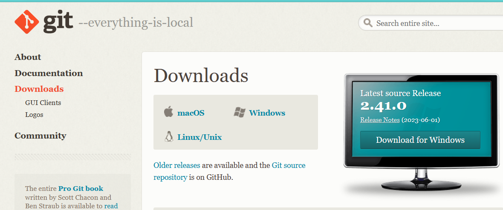
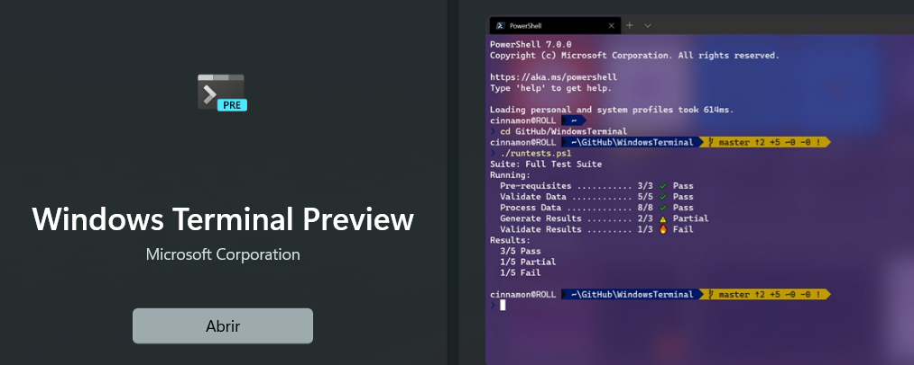
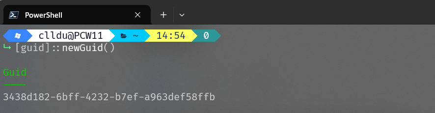
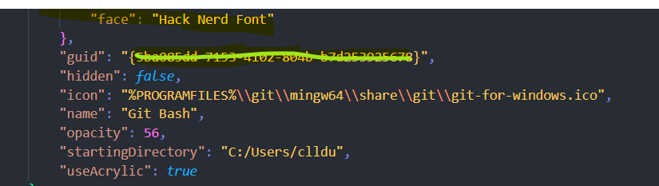
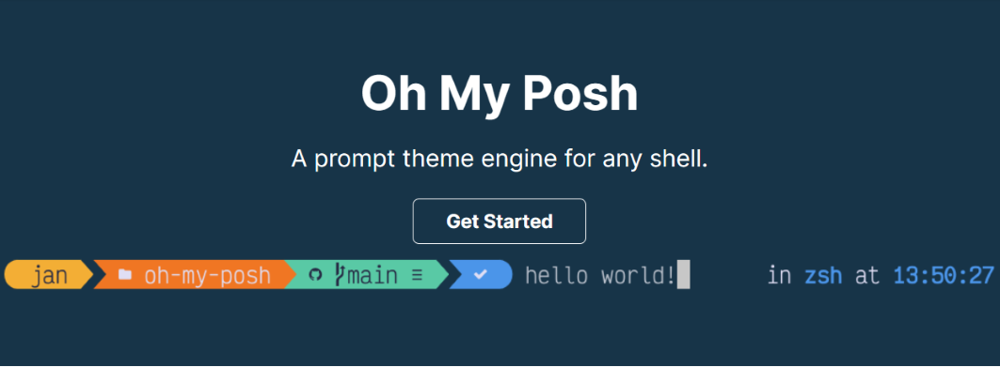
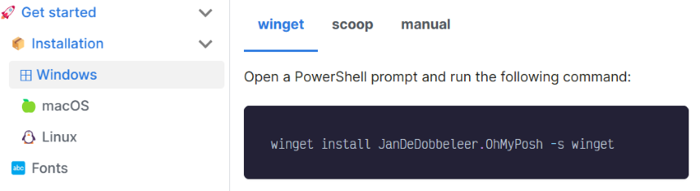
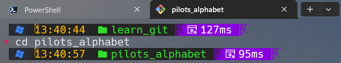
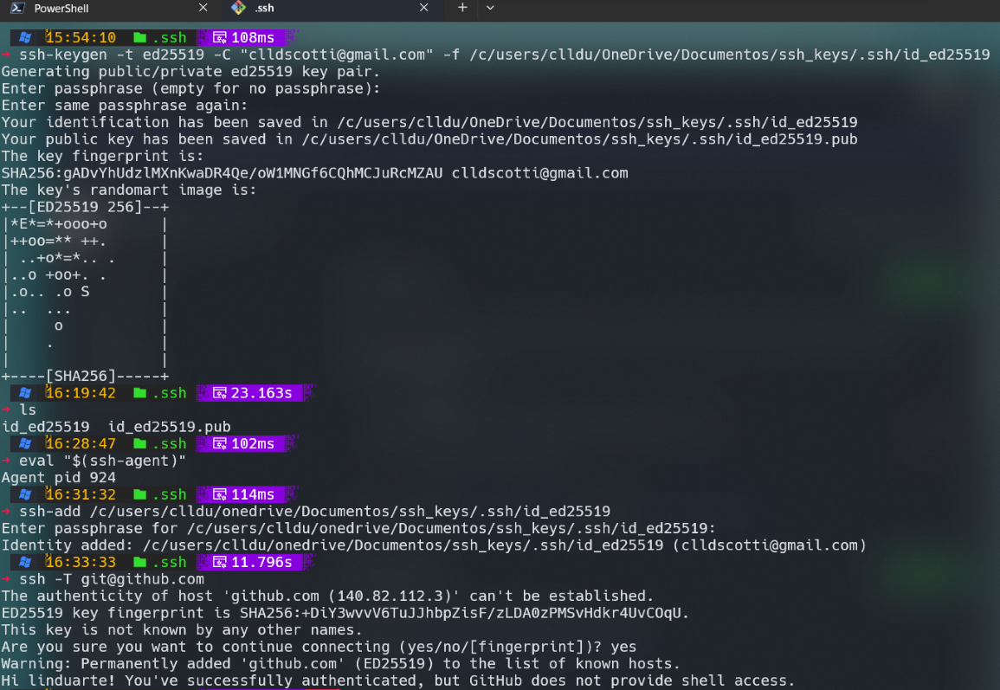

#### ***Git and Github quick guide training***

**Module one**

##### Part 1
 - #### Installation of Windows Terminal (Powershell)

 - #### Installation of Git for Windows

 - #### Customization of Powershell and Git Bash (Born again shell) using   oh-my-posh

---

Install Git-for-Windows

---
---
Install Windows Terminal

---
---
Install Powershell 

https://github.com/PowerShell/powershell/releases

v7.3.6 Release of PowerShell

PowerShell-7.3.6-win-x64.msi
758E130DC13708A72CEE29DB0B8EFD987376A4A4A22114C3B00D50CF7295D35E

---
Create a 'guid'

---
---
Abrir o arquivo json

---
---
Install Oh-my-Posh

---
---
Winget to install Oh-my-posh

---
---
Install Nerd Fonts

---
---
Create a '.bashrc' file

---
---
#### Open ".bashrc" 

 __eval "$(oh-my-posh init bash)"__

eval "$(oh-my-posh init bash --config "C:/Users/yourname/craver.omp.json")"
C:/Users/yourname/appData/Local/Programs/oh-my-posh/themes/craver.omp.json

---
Git bash terminal 


---
---
#### Part 2

 - _Setting up a Github account_

 - _Git configuration_

 - _Connecting Git to Github_
---
#### Sign up at Github


---
---
#### Git configuration

1. Set your identity:
```sh
git config --global user.name "Your Name"
git config --global user.email "your.email@example.com"
```
2. Handle end-of-line character differences:
```sh
git config --global core.autocrlf true
```
3. Prevent conversion warning messages:
```sh
git config --global core.safecrlf false
```
---

4. Set Notepad as the default editor (replace "notepad" with the command for your preferred editor):
```sh
git config --global core.editor "notepad"
```
To list all your current Git configuration settings, you can use:
```sh
git config --list
```
###### Remember that these commands will affect your global Git configuration. If you want to configure settings for a specific repository, you can omit the `--global` flag and run these commands within the repository directory.
---
What’s the best way to make your connection with GitHub safe?

To ensure a safe connection with GitHub, follow these best practices:

1. **Enable Two-Factor Authentication (2FA):** Use 2FA to add an extra layer of security to your GitHub account.
   
2. **Use Strong Passwords:** Create complex passwords that include a mix of letters, numbers, and symbols. Avoid using easily guessable information.

---

3. **SSH Keys:** Use SSH keys for authentication instead of passwords. This provides stronger security and is less susceptible to phishing attacks.


4. **Regularly Update:** Keep your operating system, browser, and any development tools up to date with the latest security patches.

---


5. **Review App Permissions:** Review and revoke unnecessary third-party app permissions that have access to your GitHub account.

6. **Beware of Phishing:** Be cautious of emails or messages asking for your GitHub credentials. Always verify the source before providing any sensitive information.

---

7. **Monitor Account Activity:** Regularly review your GitHub account activity for any suspicious login attempts.

8. **Use Verified Tools:** Only use reputable Git clients and development tools.

---

9.  **Private Repositories:** If you're working on sensitive projects, consider using private repositories to limit access.

10. **GitHub Security Settings:** Explore GitHub's security settings and features, such as security alerts, dependency insights, and code scanning.
---

 By implementing these practices, you can significantly enhance the security of your connection with GitHub.

---
#### Connecting Git to GitHub

##### The process is made up of the following steps:

 - _SSH Keys generation (private and public)_

 - _Private key registration with SSH_

 - _Public key registration on GitHub_

---

##### Ed25519

Ed25519 was introduced in OpenSSH 6.5 of January 2014: "Ed25519 is an elliptic curve signature scheme that offers better security than ECDSA and DSA and good performance". Its main strengths are its speed, its constant-time run time (and resistance against side-channel attacks), and its lack of nebulous hard-coded constants.


```sh
ssh-keygen -t ed25519 -C "unique name to identify this key"
```
---
 
---
---
Part 3

***Hosting your project on Github***

- _The phonetic website project_

 - _Hosting your project_

 - _Clonning the repository_

 - _Adding files to the project_

 - _Adding files to the index(staging area)_

 - _Commiting changes to the repository_

 - _Pushing a new version to Github_
---
#####  Links 

Git (and/or GitHub), for Dummies
https://blog.stackademic.com/git-and-or-github-for-dummies-6a363d86e1b5

Top Git & GitHub Tips & Tricks for Smooth Development
https://blog.stackademic.com/top-git-github-tips-tricks-for-smooth-development-a3b66746ca9c

---
#### Links


Setting Up SSH Access for Private GitHub Repositories
https://medium.com/@ak4634/setting-up-ssh-access-for-private-github-repositories-2e6ec8ff551b

How Do I Delete a Git Branch Locally and Remotely?
https://medium.com/git-happy/how-do-i-delete-a-git-branch-locally-and-remotely-97bc772520a7

