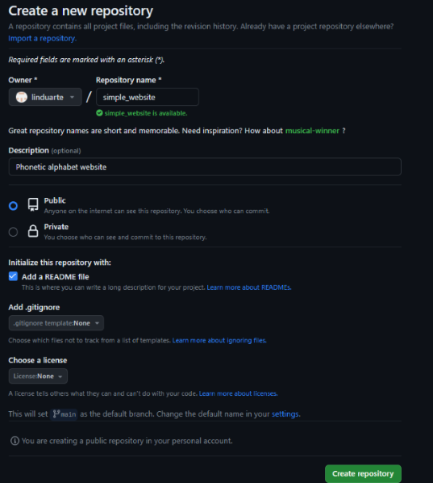
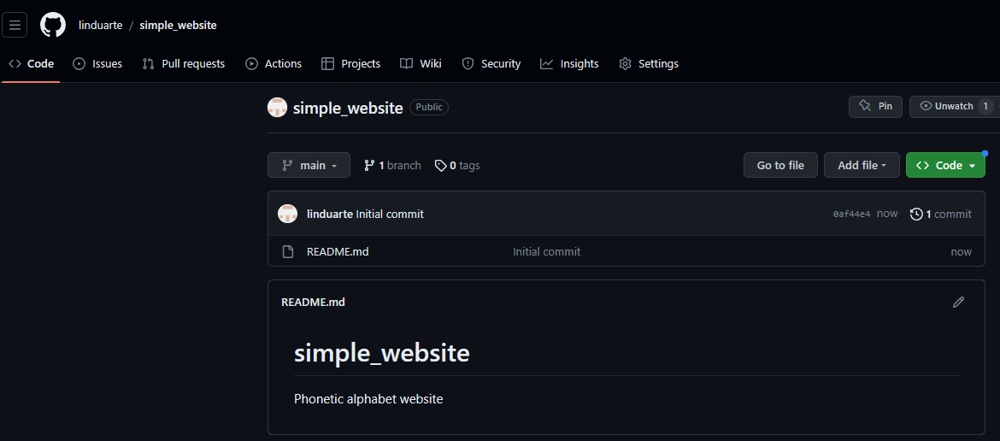
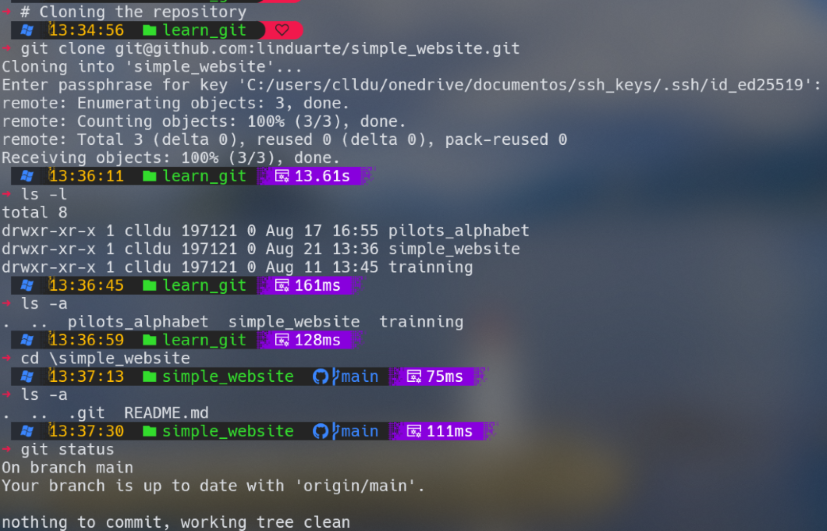
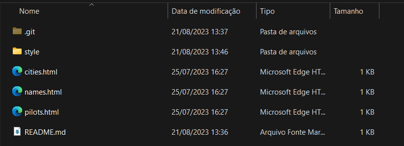
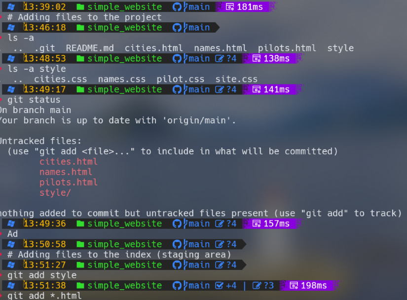
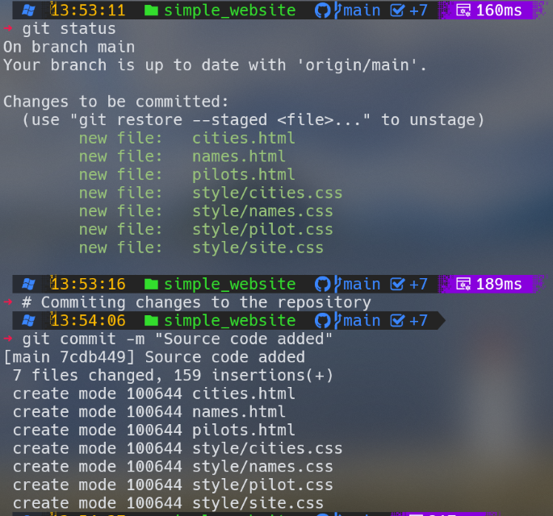
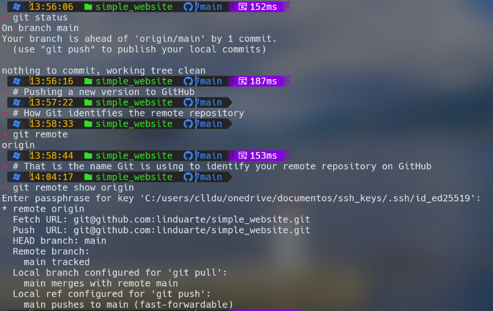
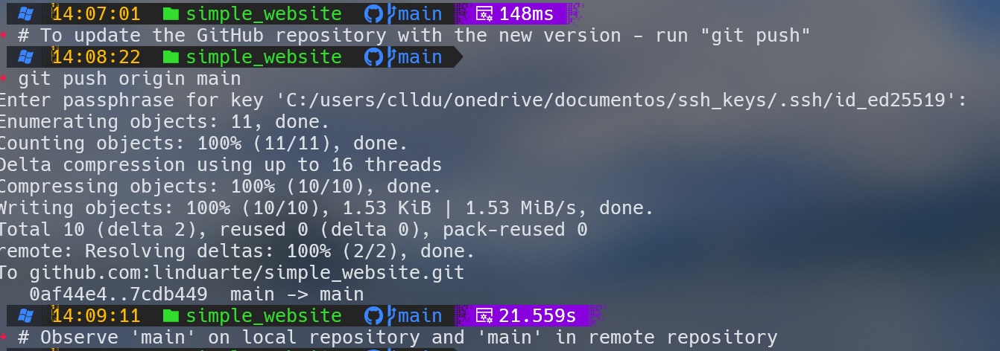
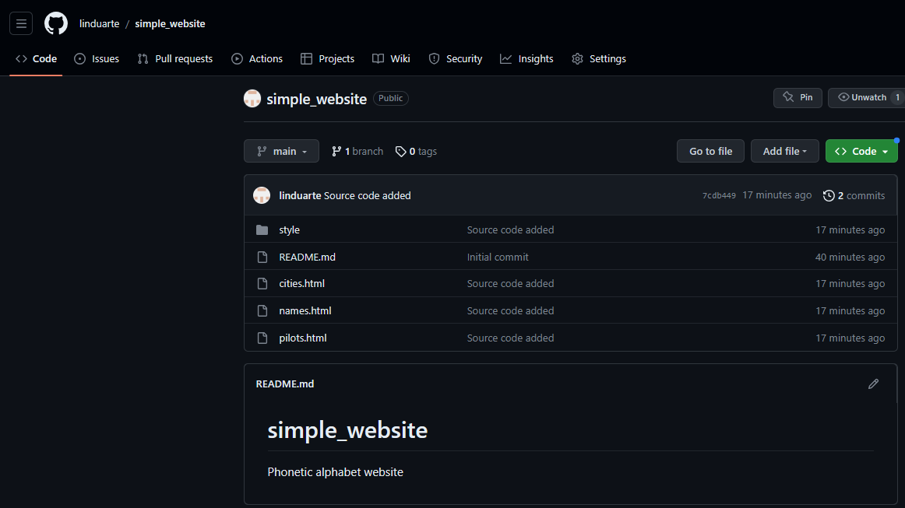

<!-- Incorrect: Multiple paginate directives -->
<!-- paginate -->
<!-- paginate -->

### ___Git and Github quick guide training___

**Module two**

<h4>

***Hosting your project on Github*** (Let´s start over)

- _The phonetic website project_

 - _Hosting your project_

 - _Clonning the repository_

 - _Adding files to the project_

 - _Adding files to the index(staging area)_

 - _Commiting changes to the repository_

 - _Pushing a new version to Github_

</h4> 

---
 
Create a repository on GitHub

---
Repository created on GitHub

---
Clonning the repository to local computer

---
Adding files to the project

---
The working directory

---
Prepare to commit

---
Pushing a new version to GitHub

---
Push is done

---
Remote 'repo' on GitHub

