**Module three**
<h1>
Project Version Control with Git 
</h1>

---
## Implementing a feature request

<h3>
A feature request is a requirement to modify or add functionality to an
application or website. Suppose that you have received a requirement to add the letter D to the Phonetic Website. To implement it you need to modify the three HTML files located in the working directory of the project.
</h3>

---
<h3>

Adding "Delta", "Detroit" and "David" to pilots.html, cities.html and names.html.

</h3>

#### Use an editor to make the changes.

---

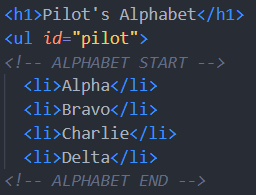
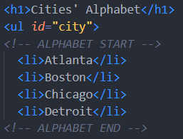
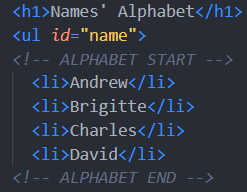

---
<h2>

Let´s take a picture using GitKraken to show us the process.

</h2>
---

---
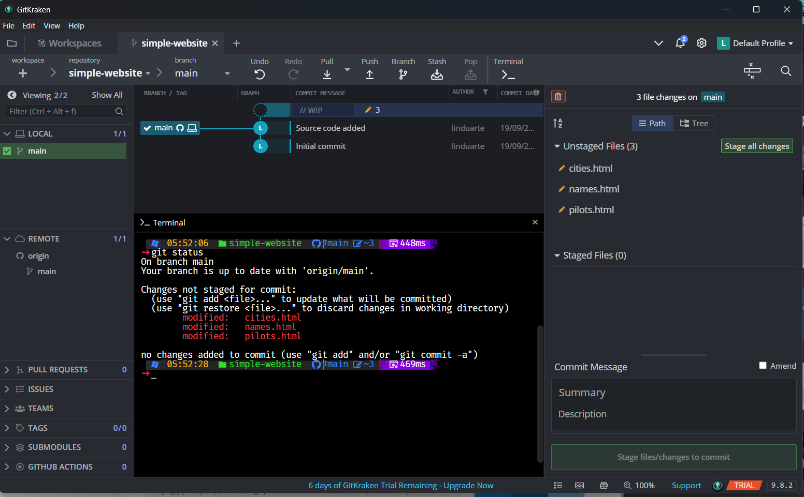

---
<h2>

After adding all html files

</h2>

---


---

<h2>

Let´s see the committing of the html files in GitKraken

</h2>

---

<h2>

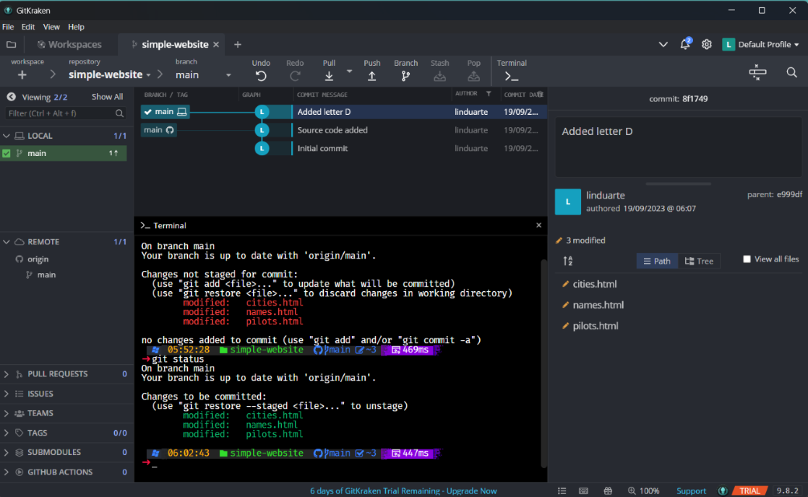

</h2>

---
### Viewing from Git bash the final status


---

### Viewing Project History

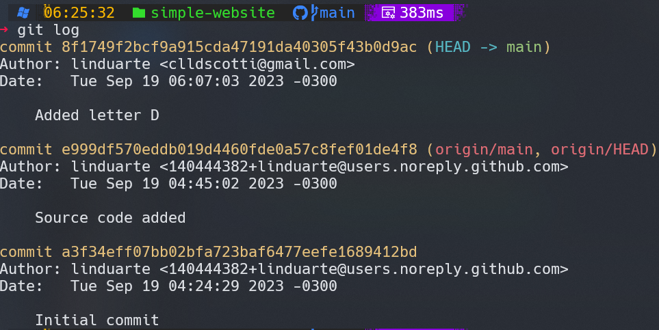

---

<h2>

Viewing Git log from GitKraken

</h2>

---

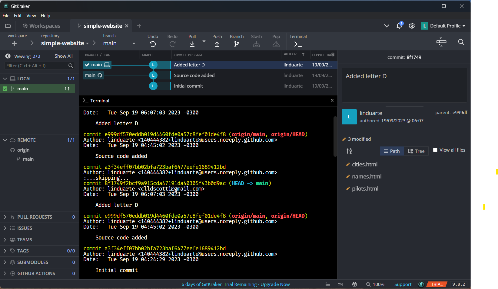

---
### A commit is a central concept in Git. Each commit represents a version of your project. You can also think of a commit as a snapshot of your project at a specific point in time. Commits allow users to undo changes in a project and go back to previous versions. We will shortly explore these features.

It is also possible to apply switches to the git log command to output information in a more compact format.

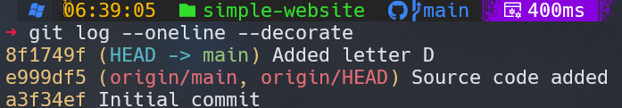

---
### A graphical vision of Git commit

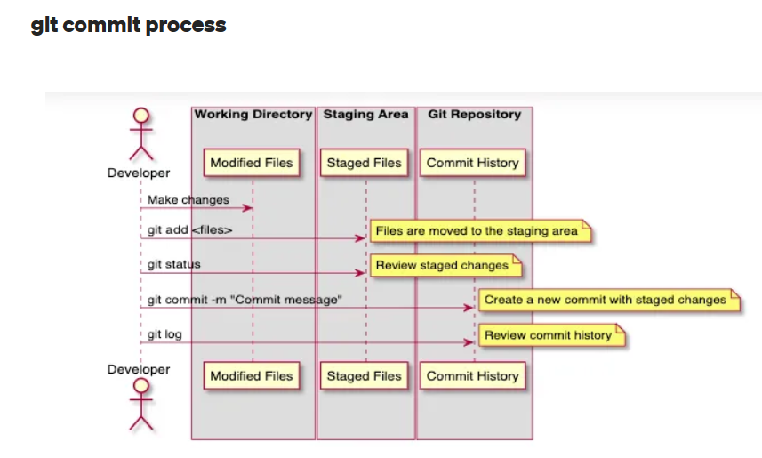

---

### Git Kraken give us a full log up to now

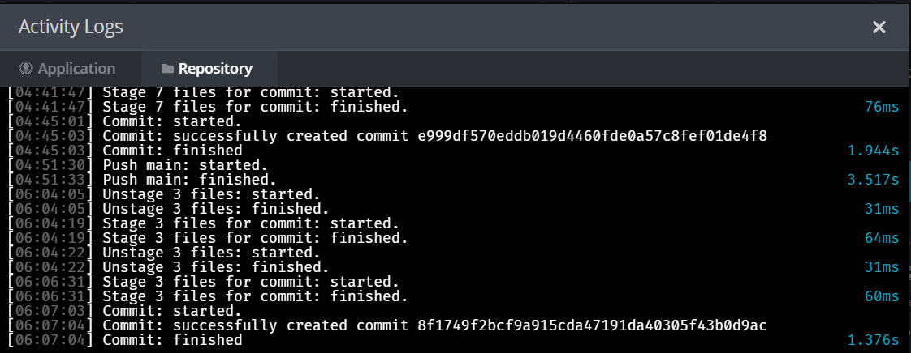

---
<h2>

A vision from Sourcetree app

</h2>
---


---

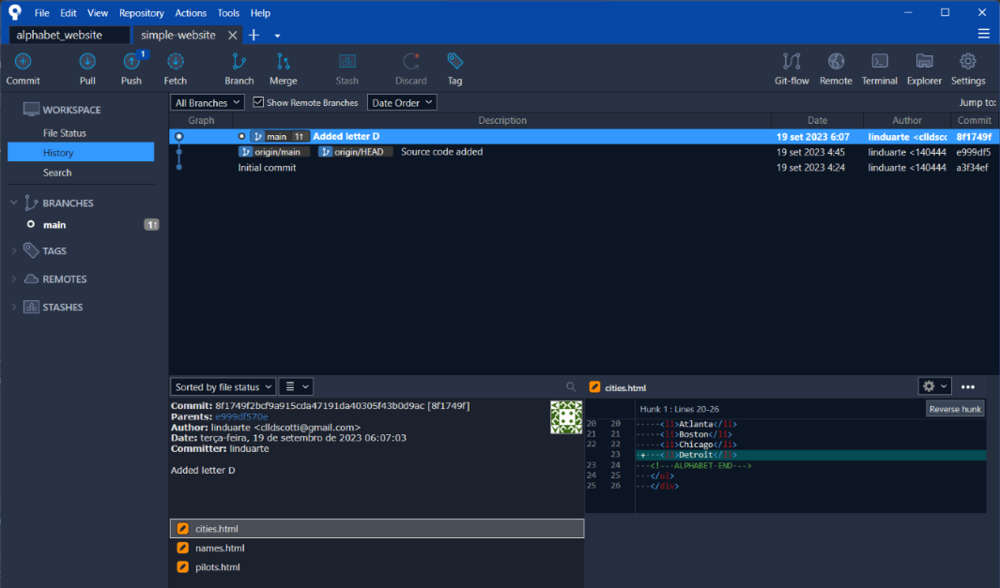

---
<h2>

A vision from GitHub Desktop

</h2>

---

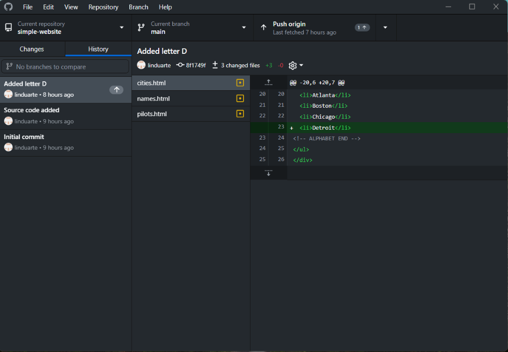

---

### What is a __Branch__?

#### A branch represents an ___independent line of development___ in a project with its own ___separate history of commits___.You can list the branches in the local repository by running the git branch command. The --remote switch shows the local copy of the branches in the remote repository on GitHub.

#### You can list the branches in the local repository by running the __git branch__ command. The --remote switch shows the local copy of the branches in the remote repository on GitHub.

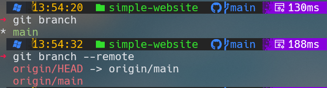

---

#### Right now your repository has only a single branch called main both locally and remotely. When you first setup a repository Git creates the main branch automatically for you. All Git projects have a main branch by default. If your Git project were a tree the main branch would be the trunk. From the trunk it is possible to manually create separate lines of development as independent branches with their own separate commits.


---

### Comparing Versions

## It is important at this point to note that there are several versions of a file in a Git project:

<h3>
1 - The <strong>working directory</strong> version (the one that you use for editing)

2 - The <strong>staged</strong> version (after you run git add <file> to add the file to the index for the next commit)

3 - The <strong>committed</strong> versions (one version for each commit)

The <strong>git diff</strong> command shows changes between the working directory, index and commit versions.

</h3>

---

### To explore the capabilities of the __git diff__ command we need to create some additional versions.

### Implement the following feature request: add the letter E to the Phonetic Website.

---

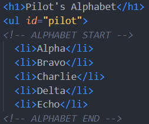
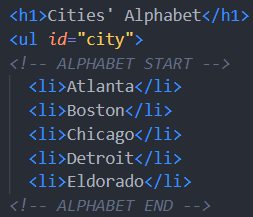
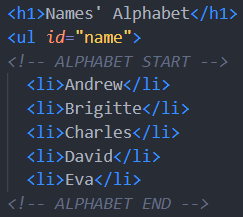

---

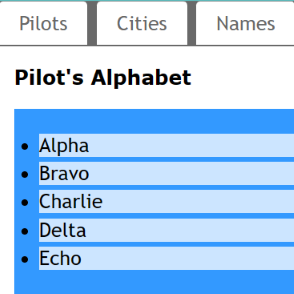
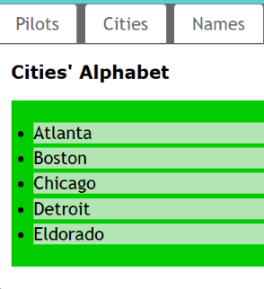
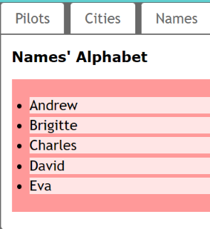

---

### Check status and add files to the index (staging area)

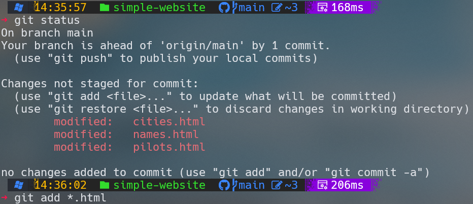

---

### Now implement another feature request: __add the letter F__ to the Phonetic Website. For example you can add the words "Foxtrot" to pilots.html,"Fillmore" to cities.html and "Fred" to names.html.

### This time __do not stage__.

---

##### As you can see from the output of __git status__ we have now two different versions of the HTML files. One version contains the staged changes in the first exercise. The second one contains the unstaged changes we did in the second exercise. And of course we also have the committed versions as shown by __git log__:

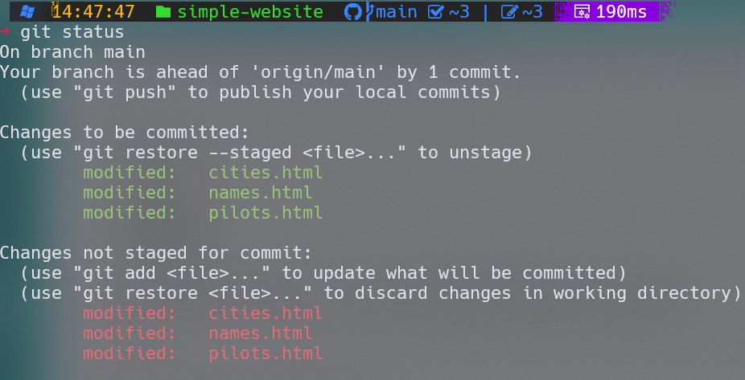

---
### Let´s check with git log the committed versions

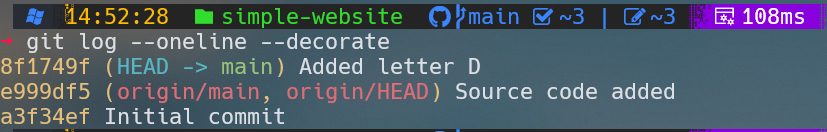

---

##### We can now use __git diff__ to view the differences between the various versions. We will take the pilots.html file as an example.

##### Viewing Unstaged Changes

##### To view the changes in pilots.html that have not been staged type:

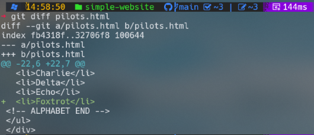

###### The output shows that the line containing the word Foxtrot has been added as indicated by the plus (+) sign. That is expected as we have added the word Foxtrot without staging the change in the second exercise.

---
#### Let´s check __git log__ and viewing unstaged changes by __git diff__


---

##### Interpreting the output of the `git diff pilots.html` command line by line.

<h5>

1. `diff --git a/pilots.html b/pilots.html`: This line indicates that the `git diff` command is comparing two versions of the file `pilots.html`. The `a/pilots.html` represents the original file, while `b/pilots.html` represents the modified file.

2. `index fb4318f..32706f8 100644`: This line provides information about the file index. It shows the commit hashes (`fb4318f` and `32706f8`) of the original and modified versions of `pilots.html`. The `100644` represents the file mode, which is typically associated with regular files.
</h5>

---
<h5>

3. `--- a/pilots.html`: This line indicates the start of the section related to the original version of the file (`a/pilots.html`).

4. `+++ b/pilots.html`: This line indicates the start of the section related to the modified version of the file (`b/pilots.html`).

5. `@@ -22,6 +22,7 @@`: This line is the unified diff header. It provides information about the line numbers and context for the changes that follow:
   - `-22,6`: This means that the change begins at line 22 in the original file and affects 6 lines.
   - `+22,7`: This means that the change begins at line 22 in the modified file and affects 7 lines. The `+` indicates that a line has been added.

</h5>

---

<h5>

So, in summary, the git diff output indicates that a single line "<li>"Foxtrot"</li>" was added at line 22 in the modified pilots.html file compared to the original version.

</h5>

---
#### Viewing Changes Between the Index and the Last Commit

#### To view the changes in pilots.html between the index (staging area) and the last commit use the __--cached__ switch:

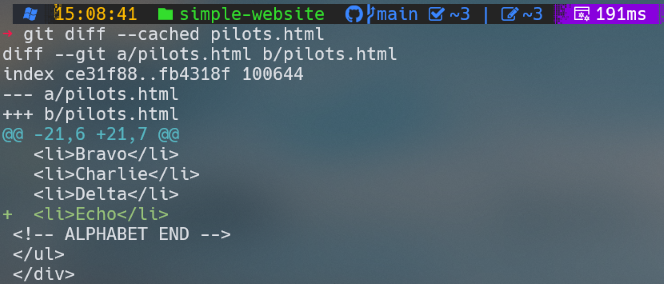

#### The output shows that the line containing the word Echo has been added as indicated by the plus (+) sign. That is expected since we have staged this change in the first exercise.

---
#### Viewing Changes Since the Last Commit

#### To view the changes in pilots.html since the last commit type:

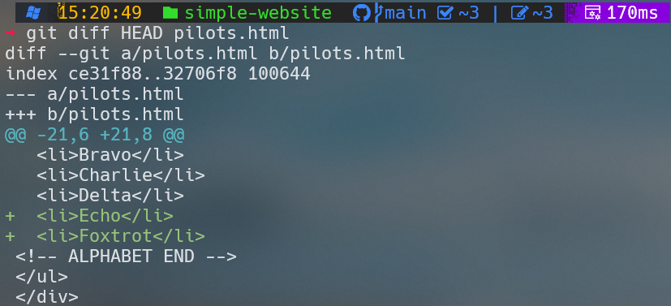

---
### The output shows that the lines containing the words Echo and Foxtrot have been added as indicated by the plus (+) signs. The git diff command interprets HEAD as the hash of the last commit. The result is expected since the last commit occurred before we made the changes in the previous two exercises.

---

### Viewing Changes Between Any Two Commits

### To view the changes between the last commit and the commit before last type:

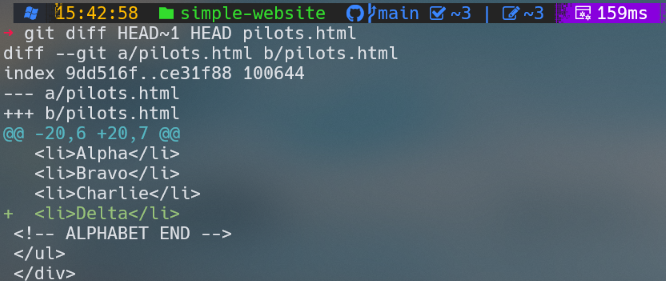

### The output shows that the line containing the word Delta has been added as indicated by the plus (+) sign. The __git diff__ command interprets __HEAD~1__ as the hash of the commit before last.

---
### You can also use the short hash obtained from __git log__ to view the difference between any two commits:

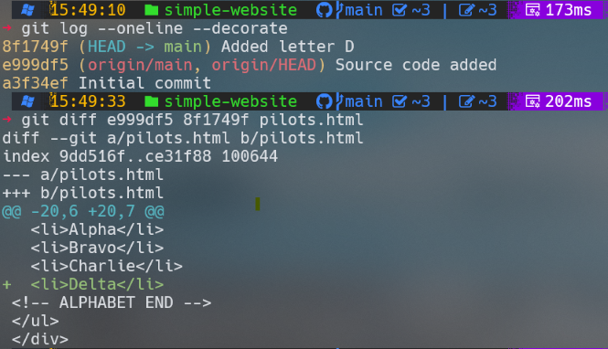

#### In the example above the hashes e999df5 and  8f1749f identify the before last and last commits.

---
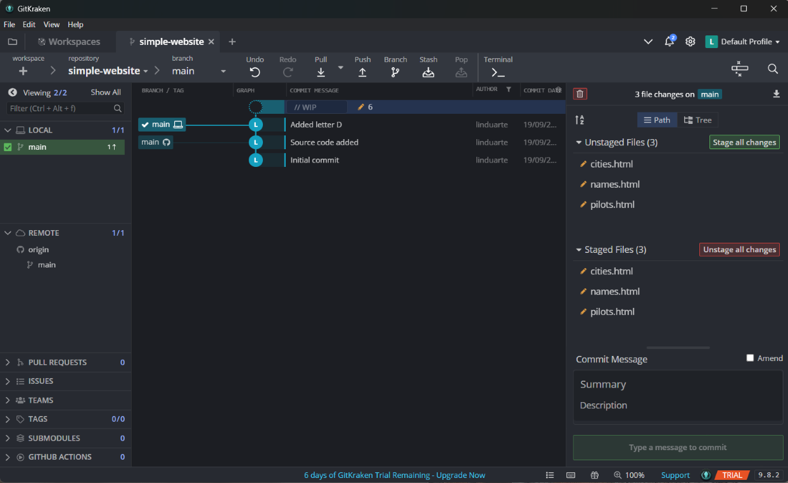

---
### We have now covered all the basic use cases. Before moving to the next section let's commit the pending changes. First commit the letter E change request which is already staged:

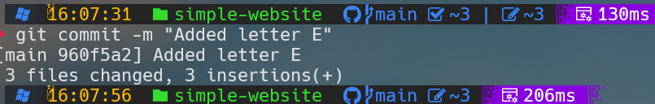

---
### Now stage and commit the letter F change request:

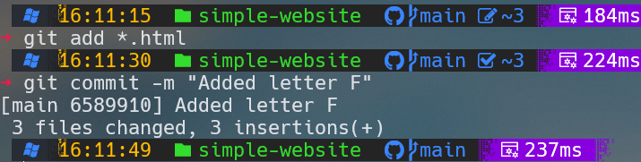

---
### You should now have a clean working directory and a longer history log:


---
### Comparing what has changed between different versions of a source code file is very useful, but what if we want to __undo__ a change?

### ___Undoing Changes___

### One of the reasons to track a project's history is to have the ability to undo changes. It is a common situation in software development: you change something, you test the change and it does not quite work the way you expected. You then decide to revert the code back to the previous version. With Git you can easily accomplish that.

---

### There are three possible undo scenarios in Git:

### 1 - Undoing changes in the working directory before staging

### 2 - Undoing changes after staging and before committing

### 3 - Undoing committed changes

---

#### Unwanted Change

##### To demonstrate each of the above scenarios we will need an unwanted change to undo. We will again use the Phonetic Website project to experiment with. If you have followed all the exercises in the previous sections you should now have a clean working directory without any uncommitted changes.

##### Open pilots.html in a text editor and delete all the words except "Alpha" so that the alphabet ends up looking like this:

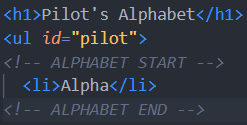
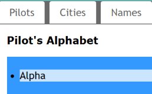

---

### Save the change and test how the page looks now when browsing the website. You should have only the letter A left in the Pilot's Alphabet. We will learn how to recover the lost words using Git undo features. In this simple case you could just manually add the lost words again to fix the problem. Suppose however the change involved editing dozens of lines of code in various parts of the source file. In that case it would be impossible to correct it manually. In such a situation Git undo features become invaluable.

---

### Undoing Changes Before Staging

#### To recover the lost words in pilots.html (following the "Unwanted Change Exercise" at the beginning of this section) all you have to do is to revert the file back to its last committed version using the __git checkout__ command as follows:

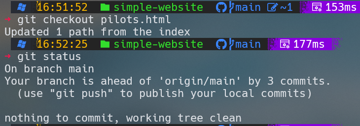
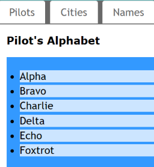


---

### Undoing Changes After Staging

### Repeat the "Unwanted Change Exercise" at the beginning of this section.Now stage the change:


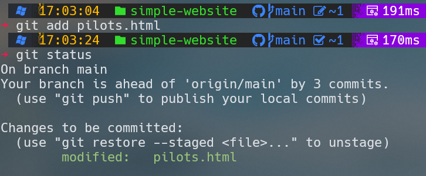

---
### Run __git status__. It shows that pilots.html is ready to be committed. It also suggests to run __git reset__ HEAD <file> to un-stage the change. And that is what we need to do first:

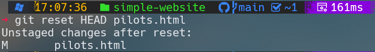

### The git reset command has removed the file from the index (staging area) however the unwanted change is still in the working directory. To recover the lost words, you still need to repeat the process for undoing un-staged changes and run git checkout to restore the last committed version:
---

### Git restore x Git reset

<h5>

Both `git restore` and `git reset` are used to undo changes in your repository. However, they work differently. 

`git restore` is used for restoring files in the working tree from the index or another commit. This doesn’t update the branch. On the other hand, `git reset` is used to update your branch.

So, if you want to undo changes that you have made to a file in your working directory but haven't staged yet, you can use `git restore`. If you want to undo changes that you have made to a file and have already staged it, you can use `git reset`.

</h5>

---
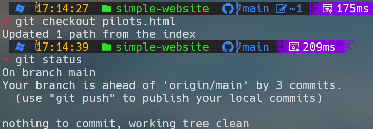


---

### Undoing Committed Changes

### Repeat the "Unwanted Change Exercise" at the beginning of this section.This time we are going to commit the unwanted change:


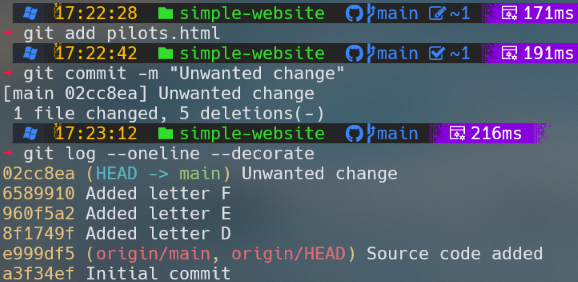

---

### To undo the committed change you need to run the __git revert__ command specifying the hash of the unwanted commit as shown in your git log output.

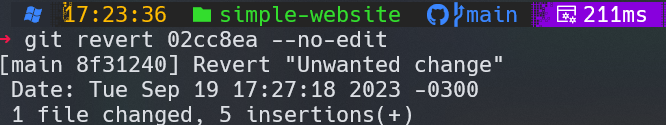

### The __--no-edit__ flag prevents the commit editor to popup.

---

### Let´s check the project history

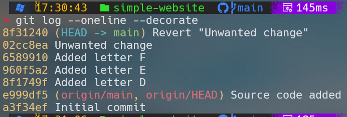

### As you can see from the git log output a revert commit was added to cancel the effect of the unwanted change. Git is designed to never loose history so it keeps the commit you want to revert and overrides it with a new one.

---
### We have covered in this section three basic undo change scenarios for a single file. Later in the sequence of slides we will learn how to navigate history and get the whole project back to a previous version. In the next section we will learn how to give a meaningful name to stable versions of a project

---

### Tagging Versions

### You can use Git to attach a tag to easily identify a stable version of a project with the __git tag__ command. The tag can be any arbitrary string but traditional versioning schemes assign a number sequence starting with zero.

### For instance, suppose you want to assign the tag v0.1 to the version (commit) where you added the letter F to the Phonetic Website project. First you need to find out what the short hash is for the corresponding commit from the history log.

---

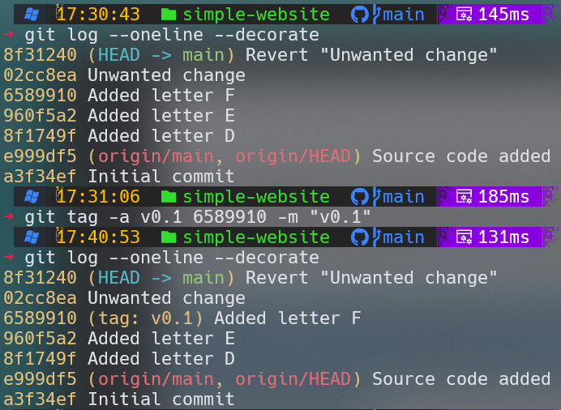

---

### Tagging Versions


<!-- backgroundColor: lavender -->
You can use Git to attach a tag to easily identify a stable version of a project with __git tag__ command.

1- __Create a Tag:__
To create a tag, you can use the git tag command followed by a tag name. For example, if you want to tag a version 1.0 of your Python project, you can do:

```bash
git tag 1.0

```
2- __List Tags:__
To see a list of tags in your repository, you can use:
```bash
git tag

```
---


3- __Tagging Commits:__
You can also tag specific commits by specifying the commit's SHA-1 hash:

```bash
git tag -a v1.1 <commit-SHA-1>
```
This creates an annotated tag with a message. Annotated tags are recommended for versioning.


---

### Tag  - Continue 


4 - __Push Tags:__
Tags are not automatically pushed to remote repositories when you push changes. To push tags, you can use:

```bash
git push origin --tags
```
This sends your tags to the remote repository.

5 - __Checkout Tags:__
You can check out a specific tag to view the code at that version:

```bash
git checkout v1.0

```

---

6 - __Delete Tags:__
To delete a tag, use the -d option:

```bash
git tag -d 1.0
```
7 - __To delete a tag on the remote repository:__

```bash
git push origin --delete 1.0
```
---

#### Let´s checking the status of the working tree:


#### The working directory is clean but the remote repository on GitHub is behind by 5 commits. It is time to synchronize:

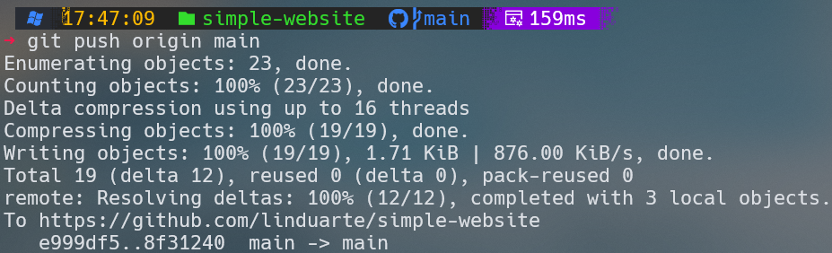

---

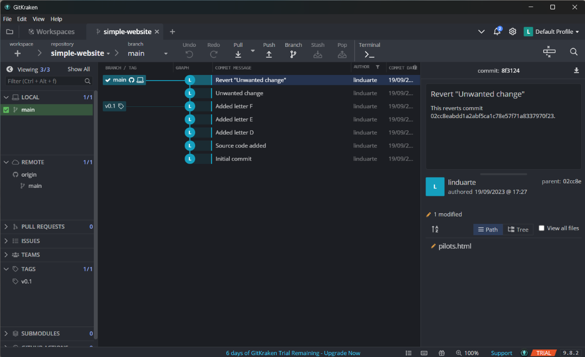

---

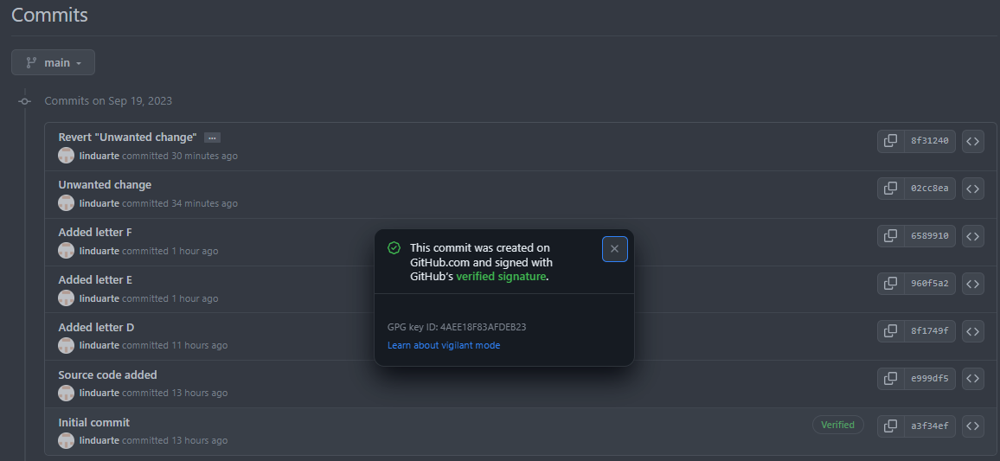


