**Module four**

### Working With Branches

1 - __Moving, deleting and renaming files__

2 - __Switching branches without merging__

3 - __Merging__ 

4 - __Resolving conflicts__

---
### Create a new branch

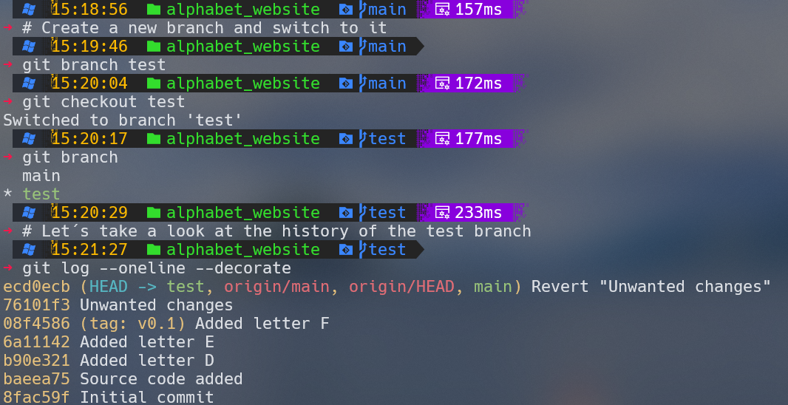
---
---
### Making changes moving all the stylesheets

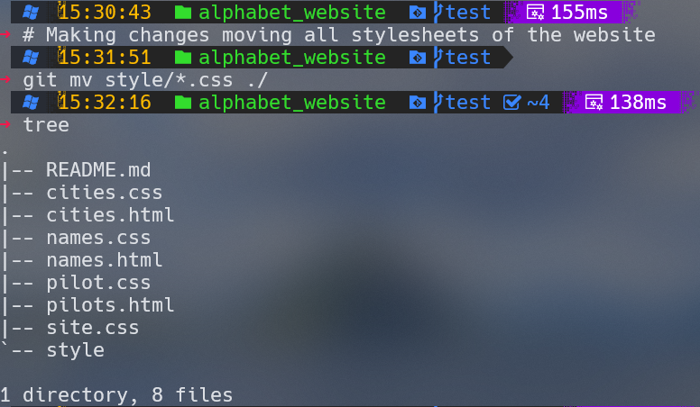

---
### Extract 'style' folder to fix all '*.html files
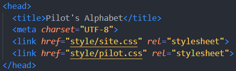

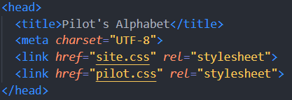

Repeat this changes to cities.html and names.html

---
### Adding changes to html files

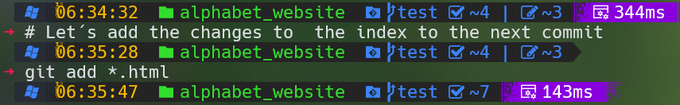

---
### Removing style folder

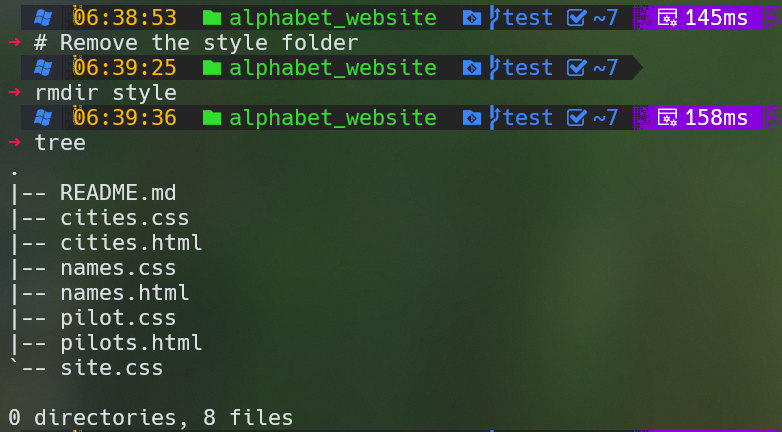

---
### Checking status

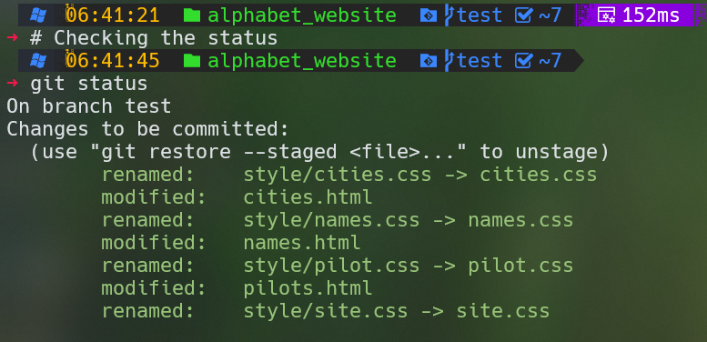

---
### Committing the changes

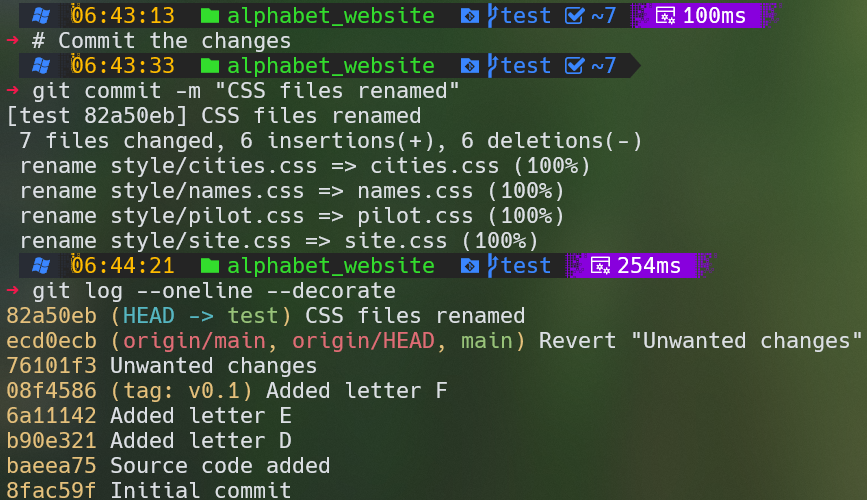

---
### Status up to now

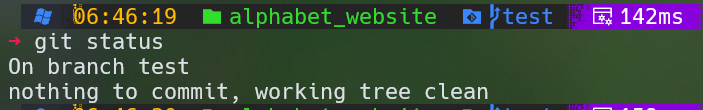

---

### Switching branches without merging

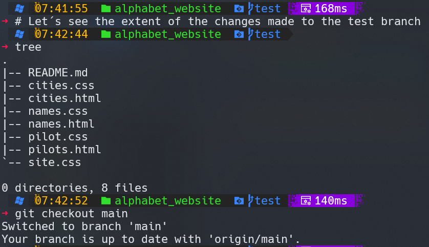

---

### Alphabet_website

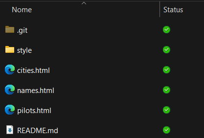

---

### How is that possible?

<h3>

Every time you switch branches Git will ___fetch from the repository database___ the contents of the working directory from the last commit on that branch.

When you run the ___git checkout <branch>___ command the HEAD pointer moves to the last commit of the branch you are checking out, and the content of the working directory reflects what is pointed to by HEAD.

</h3>

---
### 1- Graphic illustration of the switch process

#### The picture the branch feature-2 is the current branch

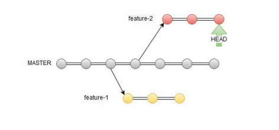

---
### 2- Graphic illustration of the switch process

<h3>
The picture is showing when you command __'git checkout main'__ the HEAD pointer moves to the __last commit of the main branch__ and the contents of the working directory.

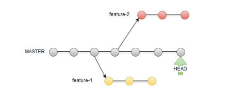

</h3>

---

### You can always verify which branch is current with either __git branch__ or __git log__. 

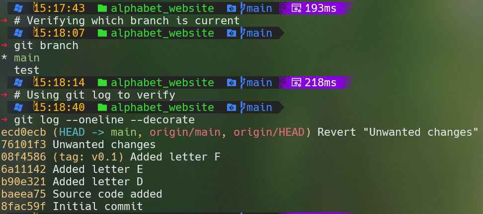

---
### Special note:

<h3>

In case you have __uncommitted changes__ when you switch to another branch, Git will try to merge those changes on to the target branch. If the changes are incompatible, then Git will not allow the switch. You can force the switch using the -f option e.g. __git checkout -f main__ if you don't care about loosing the uncommitted changes. It is good practice to __switch branches only when the working directory is clean__.

</h3>

---
### Merging

<h3>

In a typical Git workflow developers normally implement a feature request on a separate branch. This way they can freely experiment with changes without affecting the main code base. The changes are thoroughly tested in the feature branch. Only after successful testing the changes are merged on to the main development branch.

</h3>

---
### Implementing new features requests

<h3>

First one is to add the letters __G,H,I__ to the alphabet_website

Second one is to add the letters __J,K,L__ to the alphabet_website

</h3>

---
### Creating new branches

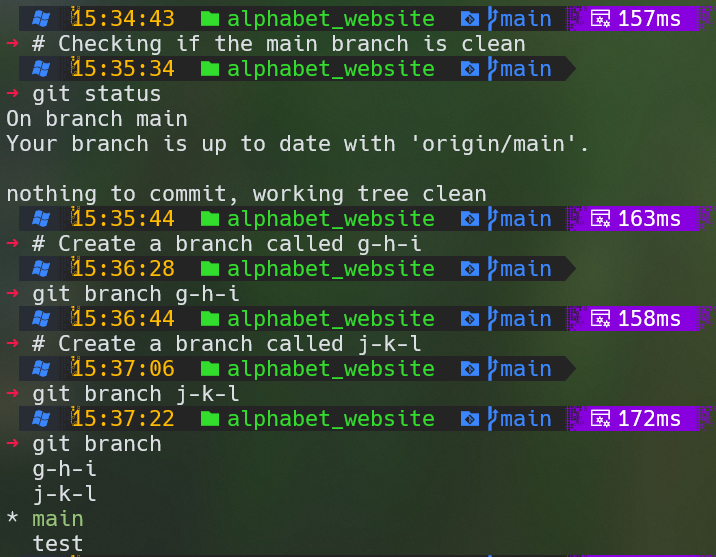

---
### Let´s add the letters G-H-I to the branch g-h-i
To add the letters G-H-I first switch to the g-h-i branch

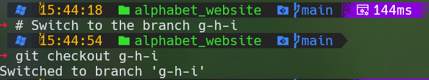

---
### Adding letters G,H,I to the alphabet_website

<h3>

Add the letter G to pilots.html, cities.html and names.html (e.g. "Golf","Greenville" and "Gloria"). Browse the website to test the changes, stage and commit with the comment "Added letter G".

Repeat the same process to add the letter H (e.g. "Hotel",
"Houston" and "Henry") then stage and commit.

Repeat the same process to add the letter I (e.g. "India","Illinois" and "Isabel") then stage and commit.

</h3>

---
### Adding letters G-H-I

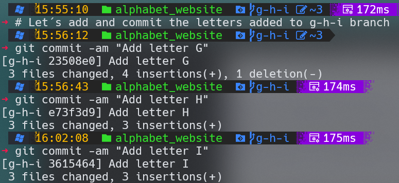

---

### g-h-i branch history look like:

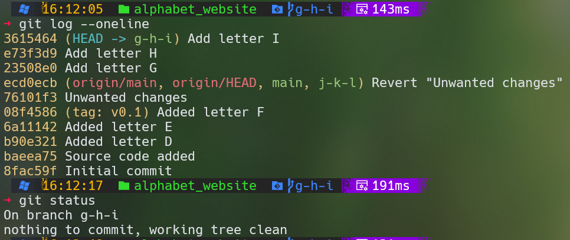

Note that the working directory is clean.

---

### We are ready to merge the changes onto the main branch.

Switch back to main and check the history

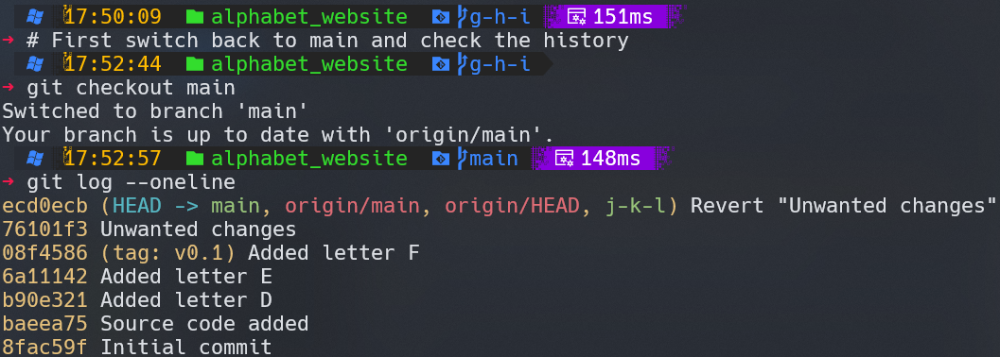

---
### Let´s browse the site

<h3>

Now browse the Phonetic Website and you will find that it is still on the letter F. This will change once we have merged the changes from the g-h-i branch. The git merge command lets you integrate separate timelines of development into a single branch. To incorporate the feature you have
implemented in the g-h-i branch into master we just need to run the following command:

__gti merge g-h-i__

</h3>

---
### Merging

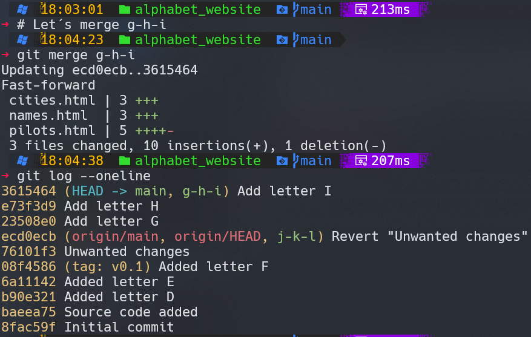

---
### Resolving conflicts

<h3>

Git does a good job of merging changes in different parts of the same file automatically. 

Sometimes a conflict may arise during the merging operation. That happens when the changes you made collide with the existing code in the branch you are merging into.

</h3>

---
### Adding letters J,K,L to the website

Now we're going to implement the second feature request adding letters J,K,L to the website.

Using the branch j-k-l already created.

---
### Exercise

<h3>

Add the letter J to pilots.html, cities.html and names.html ("Juliet", "Jackson" and "James") __immediately after__ the letter __F__.

There is a gap caused by the missing G, H and I letters. Don´t worry. We will sort out when merging the changes on to the main branch.

</h3>

---
### Letter J added to the website

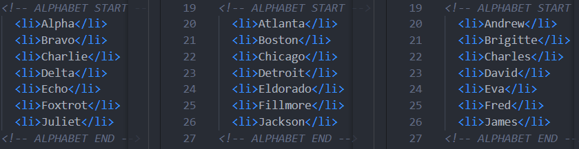

---

### Stage and commit the letters J,K,L

---
### The history of the branch j-k-l

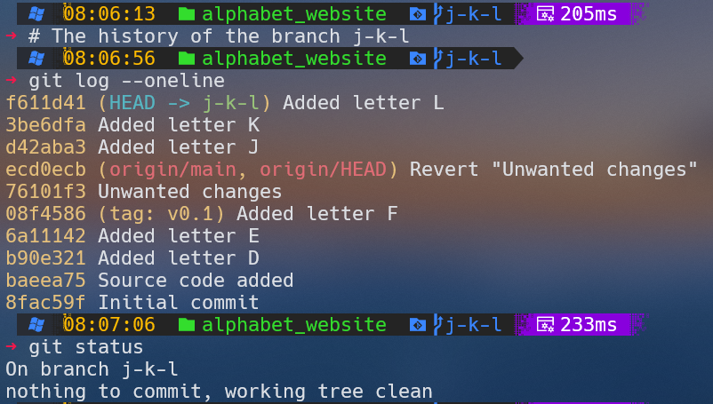

---
### Preparing to merge

<h3>

We are ready now to merge the changes on to the master branch.First switch back to master and check the history:

</h3>

---

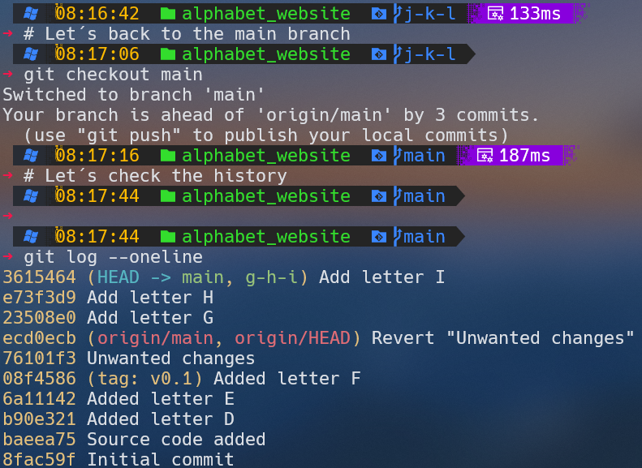

---
### Browsing the website we can find that it is still on letter "I".

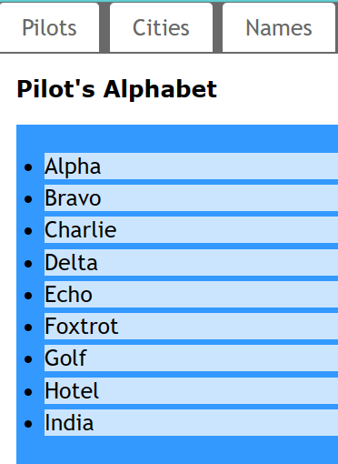

and so cities.html and names.html.

---
### Merge the last feature request

<h3>

Let's merge the feature we implemented on the j-k-l branch and see what happens:

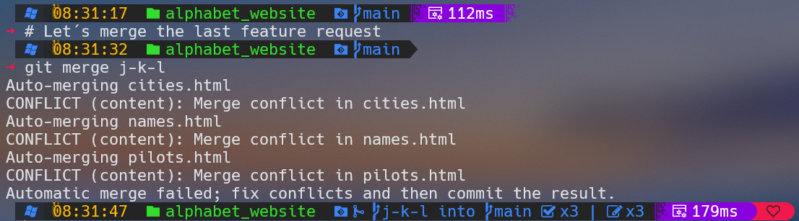

</h3>

---
### Understanding the conflit

<h4>
The git merge output is flagging conflicts on the three HTML files. That was to be expected as we made changes in the same lines of code on both branches. Running git status will tell you that the files have been modified:

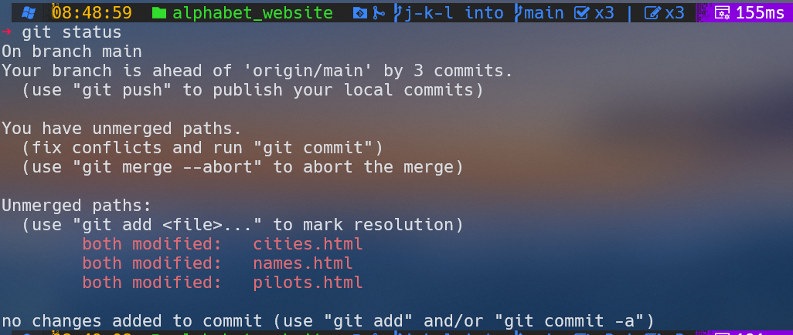

</h4>

---
### What is the way to resolve the conflicts

<h3>

In case of conflicts during a merge, Git cleverly highlights the conflicts in the source code in each file keeping both changes (the one in the feature branch and the one in the target branch) leaving it to the developer to
__resolve the conflicts manually__.

</h3>

---
### Fixing the three 'html' files
<h3>

Open the files in your favourit text editor. The __conflicting changes will be clearly marked__ by Git.

Let's fix pilots.html first. Open it in your favourite text editor. The conflicting changes will be clearly marked by Git as shown in the next slide.

</h3>

---

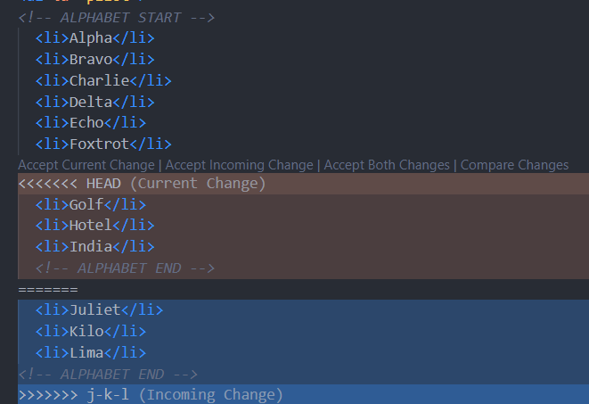

---

### Fixing (pilots.html)
<h3>

The section of code between <<<<<<< HEAD and ======= shows the code in the current branch. The section of code between ======= and >>>>>>> j-k-l shows the conflicting changes merged from the j-k-l branch.
Resolving the conflict in this case is quite easy. As we want to keep both changes we just need to delete the Git markings and retain the sequence of words in alphabetical order.

</h3>

---

### After fixing

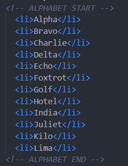

### Repeat the process for cities.html and names.html.

---
### Pilots site after fixing

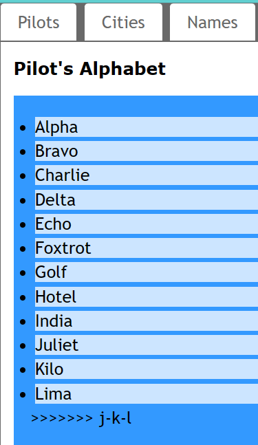

---

### Fixing the others files

<h3>

Delete also the Git markings in cities.html and names.html to resolve the conflicts and save. Browse the website to test. When all looks good, add the files to the index and commit as usual.

</h3>

---

---
### Final step

<h3>

All the commits from the j-k-l branch have been integrated. The last commit is the one you have just executed following the merge conflict resolution. The __git merge__ command is designed to preserve history whenever possible.

</h3>

---

### Tagging version

<h3>

To conclude let's tag this version as v0.2 and update the remote repository on GitHub.

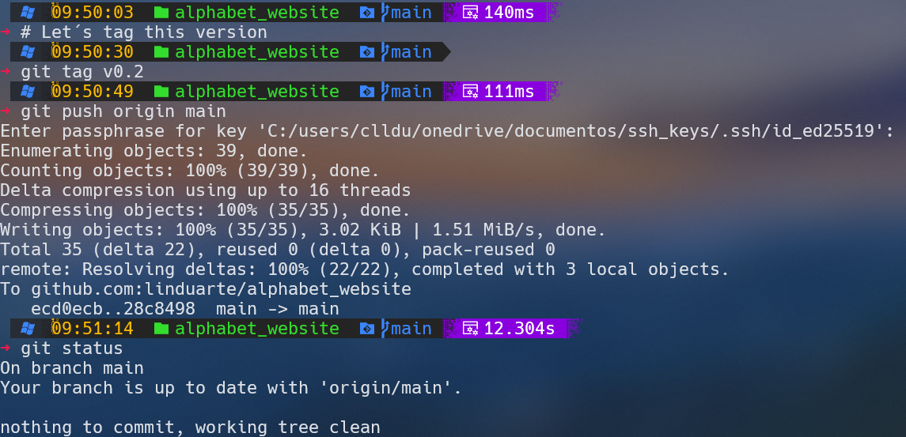

