**Module five**

## Local Repository

1 - __Initializing a Local Repository__

2 - __Going backing in history__

3 - __Changing history__

4 - __Saving changes__

---

### Up to now we have cloned remote repositories created on GitHub to kick start a project. It is also possible to create a brand new Git repository locally on your machine using the git init command.

---
Initializing a Local Repository

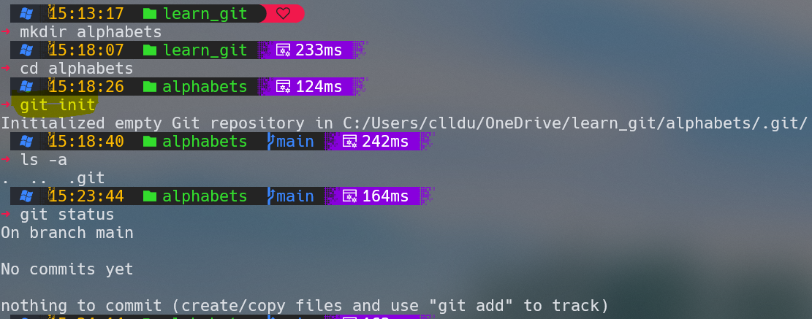

---
### Your new local Git repository is ready to use. You can now start adding files to it.

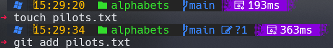
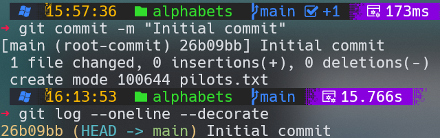

---
### Let's now build some commit history. Make a change to pilots.txt by inserting the word "Alpha" on the first line.

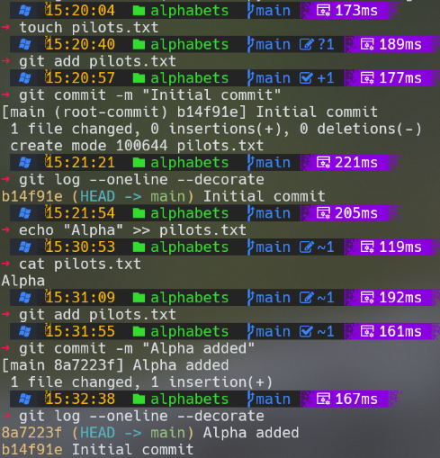

---
### Bravo and Charlie added to pilots

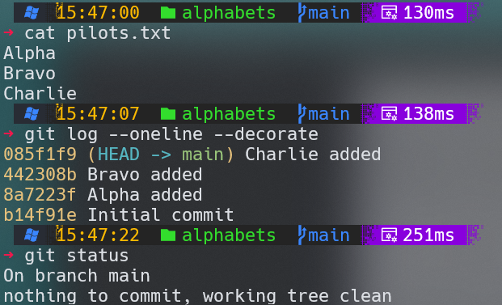

---
### A remote repository is not required to follow the exercises in this slides, however for your reference a local Git repository created with __git init__ can easily be uploaded to GitHub from the command line. All you have to do is create a new empty repository on GitHub, add it as a new remote and push the contents of the local repo.

---
### After creating a local Git repository with git init, you can push it to GitHub by following these steps:

<h4>

Go to GitHub.
Log in to your GitHub account or create one if you don't have an account.
Click the "+" icon in the top right corner and select "New Repository" to create a new repository on GitHub.
Fill in the repository name, description, and other settings as needed.
Link Local Repository to GitHub Repository:

</h4>

---
<h3>
In your local terminal or command prompt, navigate to the root directory of your local Git repository.
Use the following command to set the remote repository URL for your local repository, replacing username with your GitHub username and repository-name with the name of the GitHub repository you created in step 1:
git remote add origin https://github.com/username/repository-name.git

</h3>

---

### Commit Your Changes:
<h3>

Before you can push your code to GitHub, you need to commit your changes. Use the following commands to stage and commit your changes:
git add .
git commit -m "Initial commit"  # You can use a different commit message
Push to GitHub:

</h3>

---
<h3>

Finally, push your local repository to GitHub using the following command:
__git push -u origin main__
This command pushes your code to the main branch (or whatever branch you are currently on) of your GitHub repository. The -u flag sets up a tracking relationship between your local branch and the remote branch on GitHub, so you can simply use git push in the future to push changes to the same branch.

</h3>

---

### Authenticate with GitHub:

<h3>

If you haven't already authenticated with your GitHub account on your local system, Git will prompt you to enter your GitHub username and password or personal access token.
After completing these steps, your local repository will be pushed to your GitHub repository, and you can access it on GitHub's website. Make sure to keep your personal access tokens or credentials secure and use HTTPS or SSH for secure connections, depending on your GitHub settings and preferences.

</h3>

---

### Create a repository in GitHub

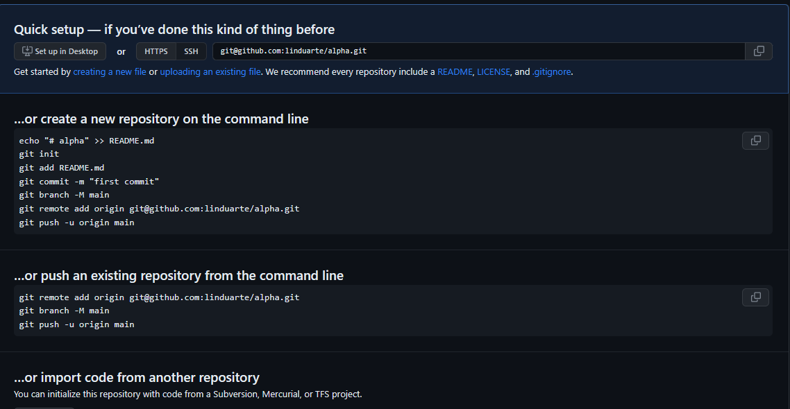

---

### Push to origin

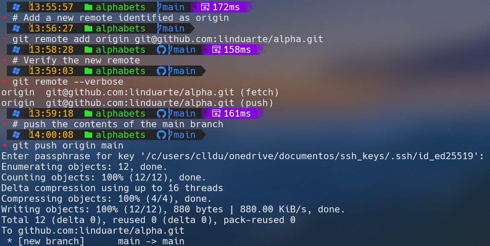

---

### Going back in history

<h3>

The git checkout command to switch branches and
to undo unstaged changes in a file. It can also be used to go back in history in the form __git checkout (commit)__ where <commit> is the hash (or identifier) of a commit in the revision history.

</h3>

---
### Detached HEAD

<h3>

This use of the checkout command will cause the files in the working directory to go back to the state they were when the specified commit took place. Once in this state, called detached HEAD state, any commit as you perform another checkout operation. To preserve any changes you make in a detached HEAD state you need to create a branch.

</h3>

---

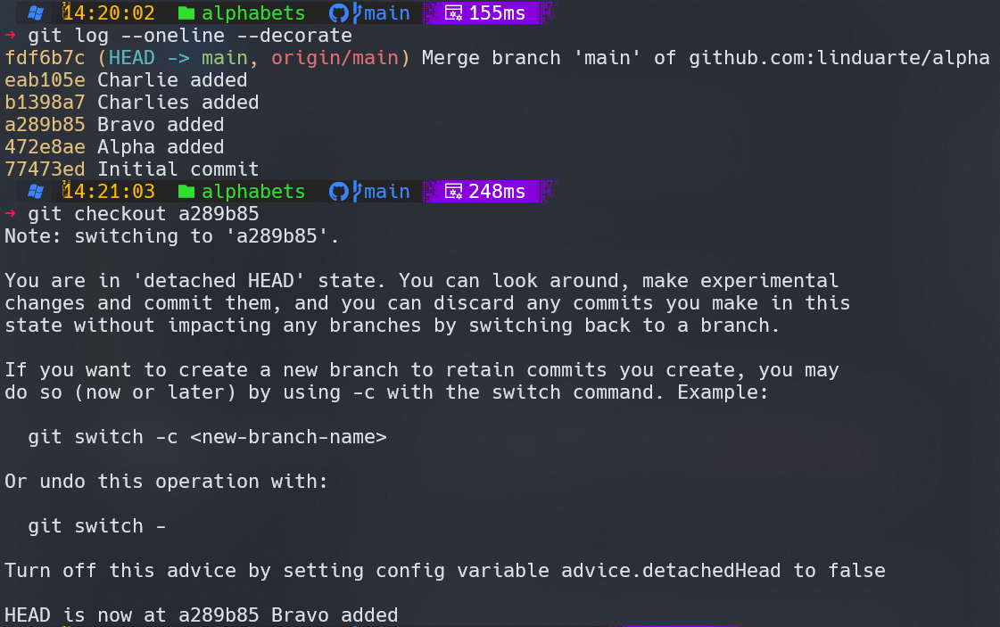

---
<h3>

The git checkout output warns of the detached HEAD state. Any new commits made whilst in this state will be lost as soon as you perform another checkout operation. We will demonstrate this with an experiment.

</h3>

---

### Let's add a new word to pilots.txt and commit:

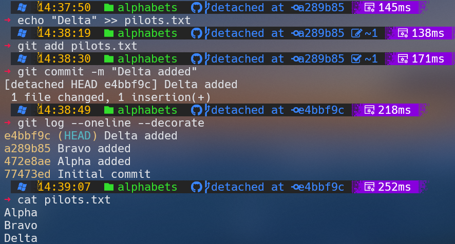

---

### HEAD usual place

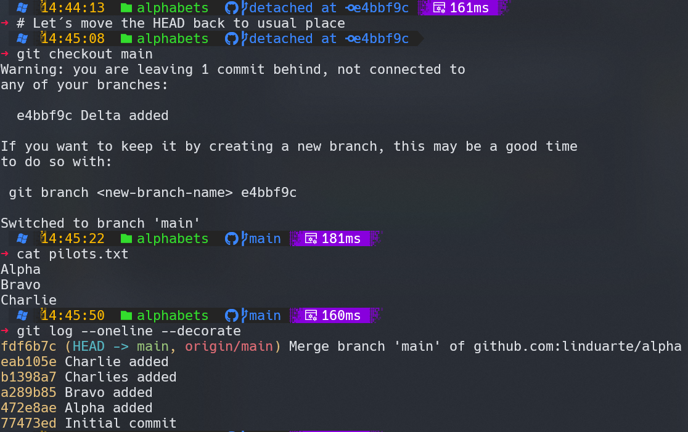

---

### In order to keep the changes you make whilst in a detached HEAD state you need to create a branch.

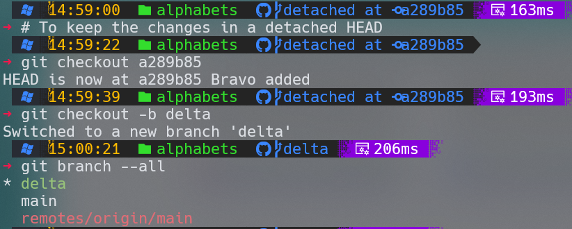

---

<h3>

Note the __git checkout -b delta__ command. The -b option creates a new branch (named delta) and immediately switches to it. The current branch is now __delta__ as you can see from the output of the __git branch --all__ command.

</h3>

---

#### Let's make the same change we did earlier to add the word "Delta" to pilots.txt and commit:

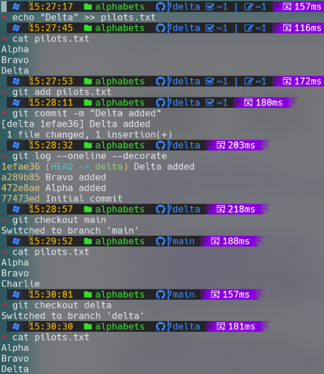

---

### To bring the changes into the main branch you just have to merge. In this case Git will flag a conflict in the third line of pilots.txt as the content differs between the two branches (we have "Charlie" in main and "Delta" in delta). 

---
### Let's switch to main and merge:

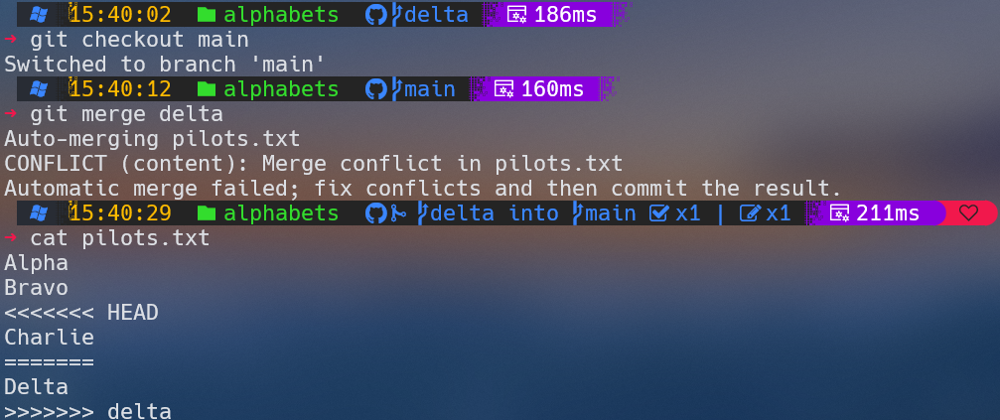

---

##### We need to resolve the conflict manually. Open pilots.txt with VSC and delete the markings added by Git leaving both words ("Charlie" and "Delta") and then commit:

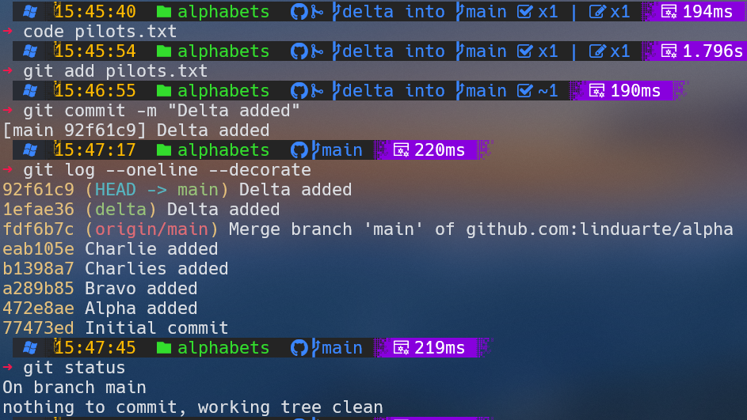

---

### Let´s understanding what happened

<h4>

The commit __1efae36__ (delta) Delta added is the merge from the delta branch.

The commit __92f61c9__ (HEAD -> main) Delta added is the commit following conflict resolution.

This experiment has demonstrated the power of the git checkout <commit> command. It allows you to go back to any point in time in the commit history of your source code, make experimental changes in a separate branch and, if required, merge the results back to the main code base.

</h4>

---

### You can use the git branch -D <branch> command to remove a development branch you no longer need:

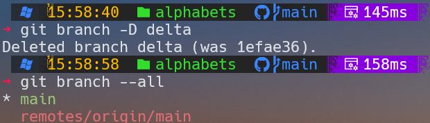

---

## Changing history

<h3>
There are two Git commands capable of re-writing the commit history of a branch: git reset and git rebase.

</h3>

<h3>

Reset
We will demonstrate what __git reset__ does with an experiment. Open Git Bash and change to the local "alphabets" repository created earlier. 

</h3>

---

### Dump the log history of the main branch:

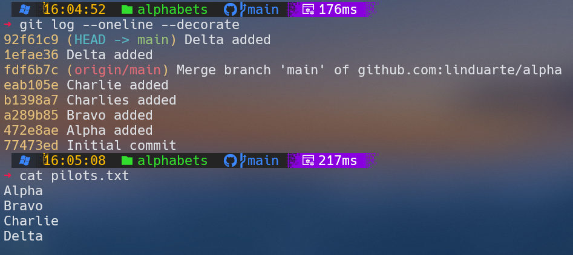

---
### Suppose you want to reset the history of commits to the point where you added the word "Charlie" (hash eab105e in my history log, it will be something else in your repo). 

### All you have to do is typing the following command replacing the hash value with the one in your history log:

---

### Now check again the history log and you will find that the last two commits have been removed. The pilots.txt file contents have gone back to the point prior to the merging operation we performed in the previous slide:

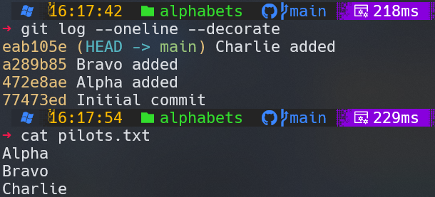

---
## Attention

### Although removing unwanted commits can be useful in some situations, it must be done with extreme caution. Warning: ___Never change the commit history of shared branches___ when collaborating with other users as it will cause them a lot of problems when you push the changes back to a shared public repository. Only use this form of reset if you want to remove unwanted commits from a local private branch.

---

## Rebase

### The command __git rebase__ can be used in place of __git merge__ to integrate the work you have done in separate branches. Whereas the merge operation preserves history, __the rebase operation can modify the target branch history__ by inserting intermediary commits.

---
### Let´s explore the difference between __git merge__ and __git rebase__.

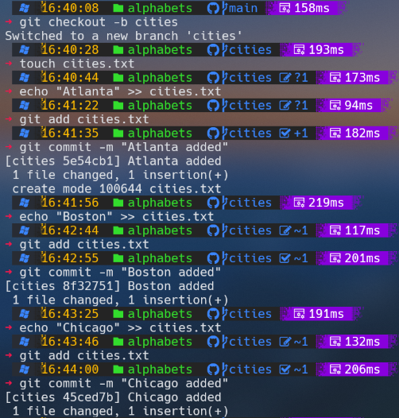

---

### After the previous process we get:

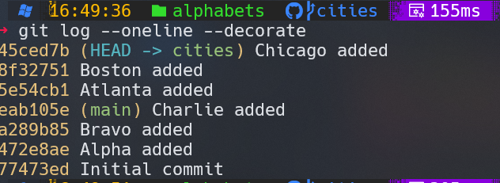

---

### Now we added Delta, Echo and Foxtrot to main branch

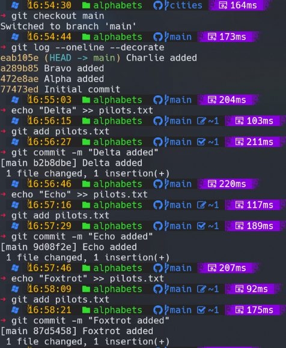

---

#### Suppose we want to integrate the work we have done on the cities branch on to the main branch. This time, instead of __git merge__, we will use __git rebase__. Let's see what happens:

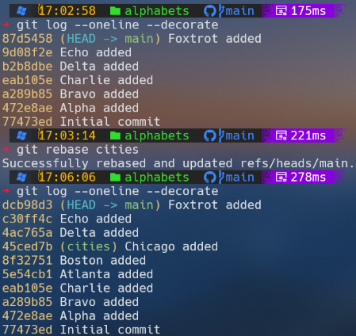

---

#### With __git merge__ the commits would have been added to the history of the main branch at the point of merge, leaving the previous history intact. The rebase operation instead has replayed the commits we did on the cities branch on top of the main branch __effectively modifying its history__ as if we had done all the work sequentially on the master branch.

---

### Warning

#### As we have already stated, changing the commit history of a public shared branch will confuse and potentially cause errors when with other users. __Only use rebase instead of merge in short-lived local private branches__ where you want to see the commit history of the feature branch replayed onto the target branch. Never use rebase on public shared branches that are pushed to remote repositories

---

### Saving changes

### The __git stash__ command can be used to "stash away" half-baked changes are not prepared to commit yet but want to keep for later.

---
#### Let´s practice on main branch adding some words and keep them staged:

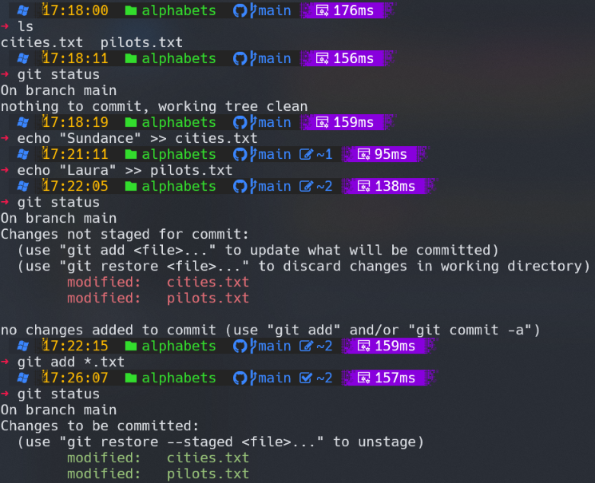

---
#### Suppose now you decide to start some other work from a clean working directory but without loosing the changes you have made so far. You can simply stash the changes away by typing:

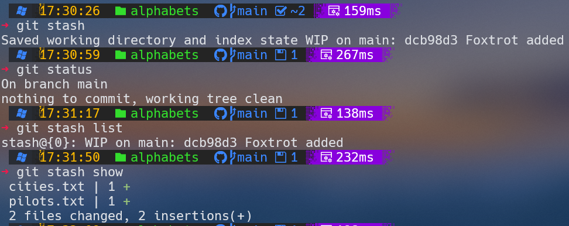

---
#### The working directory and index are now clean;

### But your changes have not been lost. You can view any modifications stashed away with the following commands:__git stash list__ and __git stash show__.

---

### When you decide to restore the work you have stashed away you can do so by entering the command __git stash apply__:

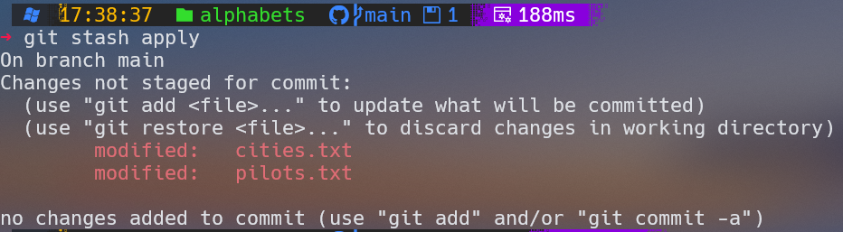

