**Module six**

### The repository database

#### Every time you initialize a local or remote Git repository a sub-directory named ___.git___ is automatically created for you. The .git directory is where Git stores all the commit history and metadata for a project. In this section we will explore the .git directory in some detail.

---

#### Start Git Bash and change to the open-website project working directory we created previously. List the contents of the .git directory:

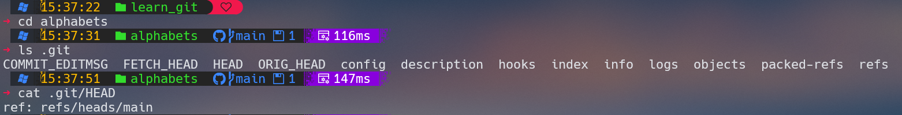

---
#### The refs directory contains references to commits for local and remote tracking branches.
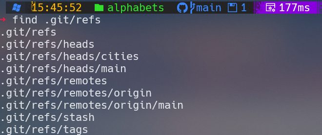
#### To see the reference to the most recent commit in the main branch type:
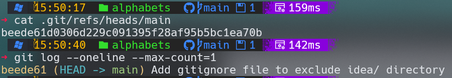

---

#### The actual commits are stored in the objects directory. Git stores four types of objects in this directory: commits, trees (directories), blobs (files) and tags.

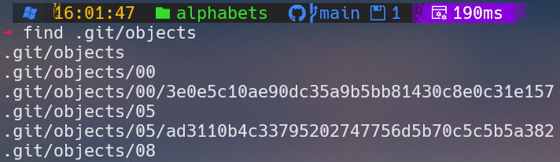
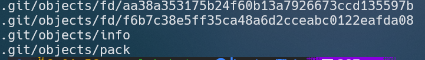

---

#### You can find out the type of each of the objects listed above using the git cat-file command with the -t option. You only need to specify the first seven characters of the object's hash.

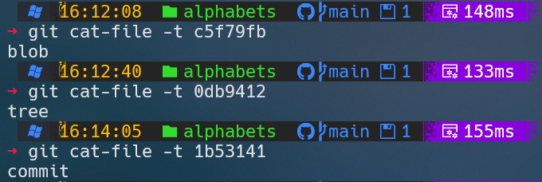

---

#### The git cat-file output confirms that it is a commit object. You can look at its contents using the -p option

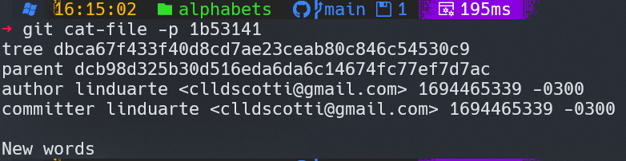

---

#### If we use cat-file pointing to the tree we get:

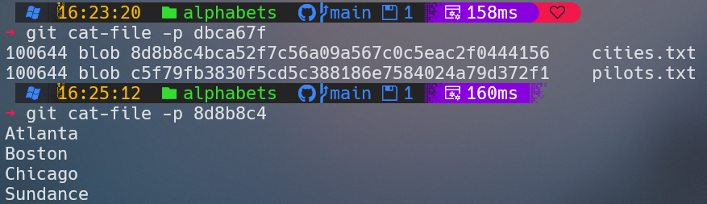

#### We have followed the trail from HEAD all the way to the last commit object on main and the associated directory and files. This is how Git stores the project history and is able to retrieve any previous versions.

---

#### Let´s take a look of the "alphabets' site showing folders and files.

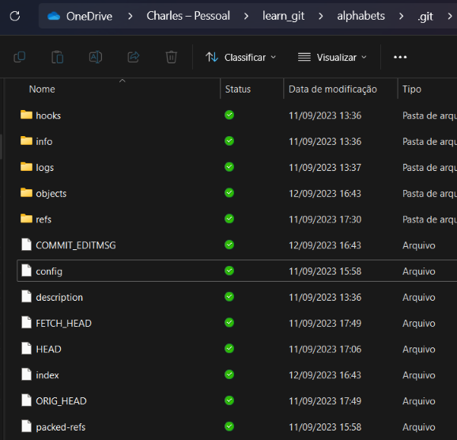

---

### The config file contains project-specific configuration. The index file is the staging area where changes are grouped before doing a commit. The hooks directory contains scripts that are executed before or after a specific Git command. The info directory contains additional information about the repository.The logs directory contains the history of each branch as displayed by the git log command.

---

### A More Sophisticated History View

#### We have often used the __git log__ command with the __--oneline and --decorate__ options to view the history of commits in a project. However there is a way to type less and get more information out of git log by using aliases. An alias is an alternative name that you can give to a Git command.

---

#### Aliases can be setup in the Git configuration file .gitconfig located in your home directory. Start Git Bash and enter the following commands to locate it:

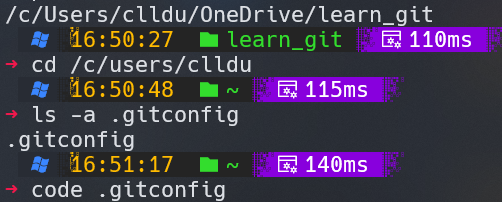

#### Add an [alias] entry named hist:

[alias]

##### __hist=log --pretty=format:'%C(yellow)%h %Cred%ad %Cblue%an%Cgreen%d %Creset%s' --date=short__

---

#### To try the new alias change to a Git project working directory and type git hist:

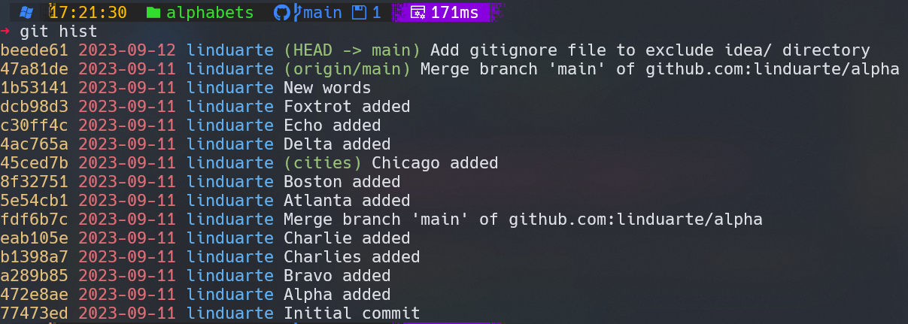

---

#### You can still append additional switches such as the -- max-count to limit the output to the more recent commits only:

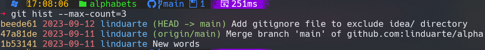

---

## Ignoring Files

### In a project there are often files that you do not want Git to track because there is no interest in keeping a version history of them. They can be binary files produced by a compiler or other temporary files generated automatically by code editors and other tools. You do not want all this "noise" in your working directory to go into your project history repository.

---

### To prevent Git from tracking such files and directories all you have to do is to create a text file named __.gitignore__ in the root of the working directory of your project. Inside .gitignore you can specify the names of files and directories you want Git to ignore.

---

#### Suppose we want to ignore all files with a __.bak__ extension. Start Git Bash and change to the alphabets project working directory:

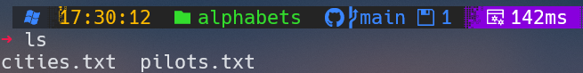

#### Create a file with the .bak extension by copying an existing file:

---

#### Git will normally track the .bak file we just added:

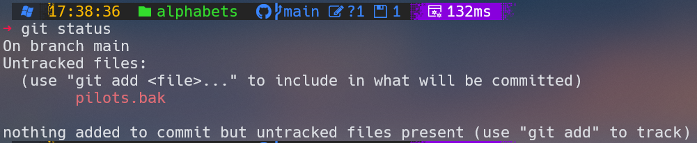

#### To tell Git to stop tracking files with a .bak extension first create a __.gitignore__ file:

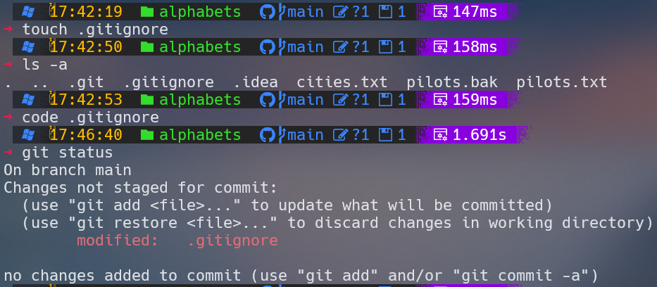

---

#### As you can see git status is now ignoring __*.bak__ files. It is good practice to commit the __.gitignore__ file to the repository:

---

#### You can also instruct Git to ignore an entire directory. Let's create a new directory called temp containing two files using the command sequence:

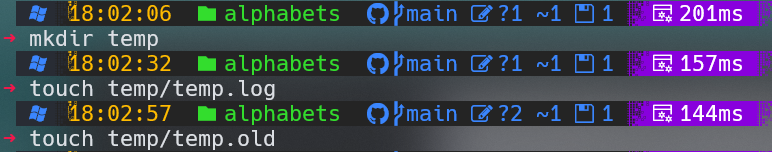

---
#### Open .gitignore in a text editor and add the directory name to the list.

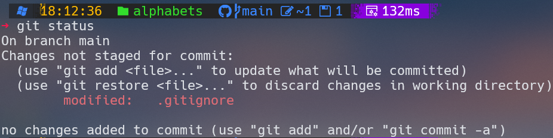

#### Commit the changes to __.gitignore__:

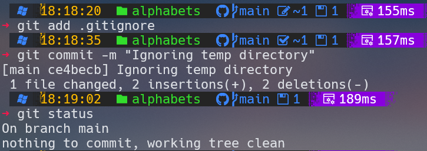

---

#### After all those steps let´s check the final history:

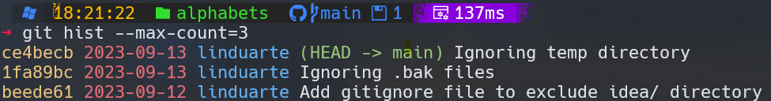

---

### Git workflows

---